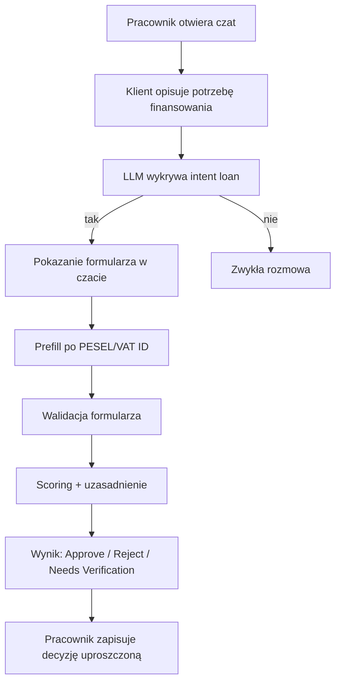
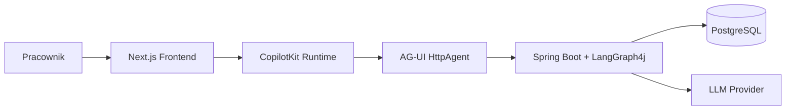
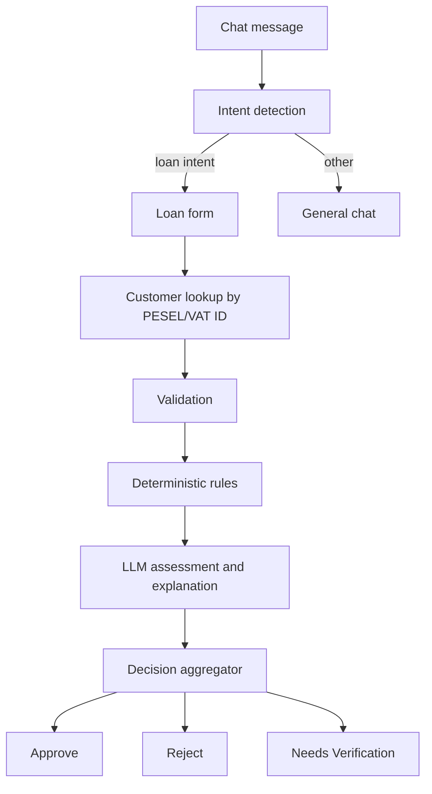
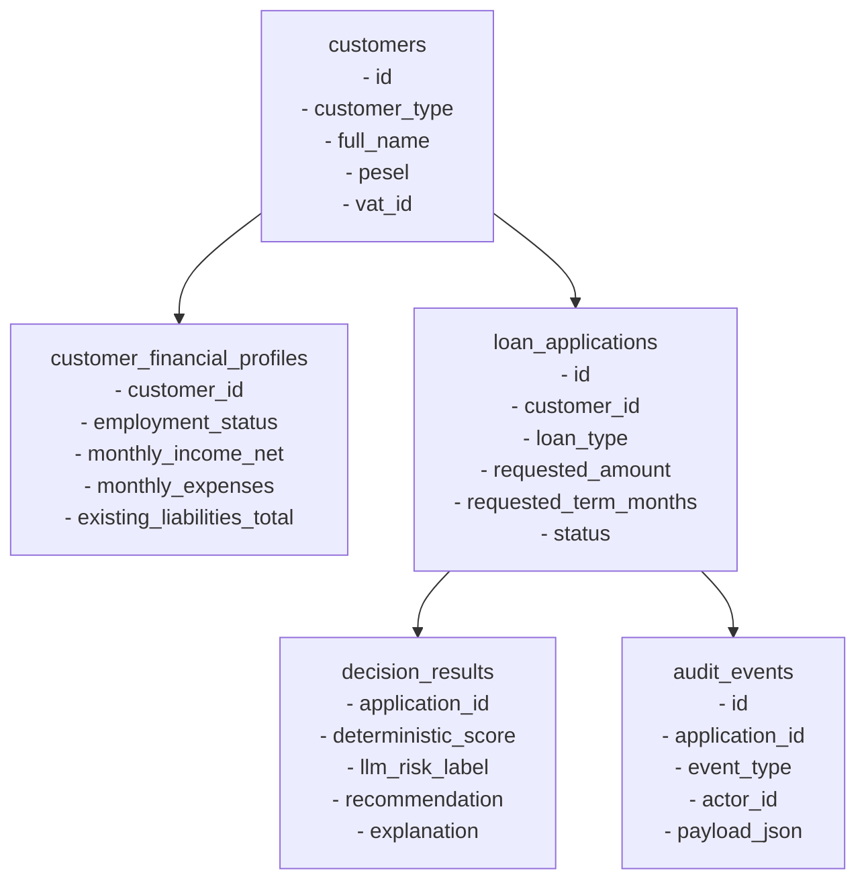

# Loan Decision Copilot: ADR i Plan Implementacji PoC

## Status
Proposed

## Cel dokumentu
Ten dokument opisuje docelową architekturę PoC dla projektu `Loan Decision Copilot` w tym repozytorium. Łączy wymagania z PRD z decyzjami technologicznymi opartymi o:

- `langgraph4j-copilotkit`
- CopilotKit
- AG-UI
- LangGraph4j
- aktualny układ repozytorium z `backend/`, lokalnym PostgreSQL i skryptami seed/init

Dokument ma służyć jako instrukcja wykonawcza dla agenta implementującego rozwiązanie.

## Założenia PoC
- PoC ma być szybkie do wdrożenia i demonstracyjne, nie produkcyjne.
- Brak pełnej autentykacji i autoryzacji.
- Identyfikacja klienta odbywa się po `PESEL` albo `VAT ID` podanym lub potwierdzonym w formularzu.
- Dla potrzeb audytu w PoC używamy technicznego identyfikatora pracownika, np. `demo-employee-1`.
- Baza danych to PostgreSQL uruchamiany przez obecny [`compose.yaml`](/C:/Users/labuser/Documents/AI-Programming-Course-JSystem-03-2026/compose.yaml).
- Frontend powstaje jako osobna aplikacja `frontend/` w Next.js, na wzór `copilot-app`.
- Integracja agentowa opiera się na `langgraph4j-ag-ui-sdk` oraz `copilot-app`, nie na zdeprecjonowanym `langgraph4j-ag-ui-impl`.
- W MVP używamy oryginalnego Java Community SDK AG-UI przez git submodule `ag-ui` w root repo oraz lokalny build Maven całego reactora.
- W MVP nie implementujemy własnego fallbacku AG-UI po stronie Java.
- To jest rozwiązanie przejściowe na potrzeby kursowego template/MVP. Produkcyjnie lepiej użyć oficjalnie publikowanych artefaktów Maven, a jeśli nadal ich nie będzie, utrzymywać osobny build i publikację artefaktów poza repo aplikacji.

---

## Diagram 1: User Flow

## Diagram 2: High-Level Architecture

## Diagram 3: Decision Flow

## Diagram 4: Uproszczony Data Model Overview

---

# ADR-001: Wariant integracji agentowej

## Kontekst
PRD wymaga interfejsu chatowego, wykrywania intentu, dynamicznego formularza, explainability i pełnego logowania kroków. Wcześniejsza analiza repo `langgraph4j-copilotkit` pokazała dwa warianty:

- stary `langgraph4j-ag-ui-impl`, oznaczony jako deprecated,
- nowy `langgraph4j-ag-ui-sdk`, oparty o oficjalny AG-UI Community SDK i `HttpAgent` po stronie frontendowej.

Repo referencyjne z `ag-ui-sdk` działa w praktyce przez:

- git submodule `ag-ui`,
- build całego root reactora Maven,
- lokalne zbudowanie artefaktów `com.ag-ui.community:*`,
- uruchomienie modułu `langgraph4j-ag-ui-sdk` dopiero po tym kroku.

## Decyzja
Implementacja PoC ma używać:

- backendu Spring Boot + LangGraph4j + AG-UI Community SDK,
- frontendu Next.js w `frontend/`,
- CopilotKit runtime + `HttpAgent`,
- wzorca z `langgraph4j-ag-ui-sdk` oraz `copilot-app`.

Nie używamy `langgraph4j-ag-ui-impl`.
Nie używamy też własnej ręcznej implementacji protokołu AG-UI po stronie Java.

W MVP wariant AG-UI Community SDK wdrażamy dokładnie tak jak w template:

- w root repo utrzymujemy git submodule `ag-ui`,
- podczas setupu wykonujemy `git submodule update --init --remote`,
- następnie wykonujemy root build Maven, który buduje także `ag-ui/sdks/community/java`,
- backend konsumuje oryginalne artefakty `com.ag-ui.community:*` z lokalnego builda,
- uruchomienie backendu i frontendu automatyzujemy skryptami repo.

Docelowy flow:
- `frontend` rozmawia z lokalnym route CopilotKit,
- route używa `HttpAgent`,
- `HttpAgent` wysyła request do backendowego endpointu AG-UI,
- backend uruchamia graph LangGraph4j, pobiera dane z bazy, wykonuje scoring i zwraca eventy AG-UI.

## Konsekwencje
- PoC będzie zgodne z aktualnym kierunkiem integracji `langgraph4j-copilotkit`.
- Unikamy ręcznego parsowania SSE w custom adapterze TypeScript.
- Implementacja będzie bliższa wzorcowi referencyjnemu niż własny fallback AG-UI.
- Setup lokalny będzie wymagał submodule i root builda, więc README i skrypty startowe są częścią rozwiązania MVP.
- Agent implementujący będzie musiał przenieść przykładowe klasy z wzorca do modułu produkcyjnego, bo sample w `langgraph4j-copilotkit` siedzą częściowo w `src/test/java`.

## Ryzyka
- Zależności CopilotKit i AG-UI mogą wymagać drobnego dopasowania wersji.
- Uczestnik kursu może zapomnieć o inicjalizacji submodule albo uruchomić build tylko dla jednego modułu zamiast dla root reactora.
- Integracja `useCoAgent` i własnych komponentów UI może wymagać iteracji.
- Przenoszenie wzorca z repo referencyjnego bez selekcji grozi nadmiarem kodu.

## Trigger rewizji decyzji
- Jeśli `HttpAgent` okaże się niewystarczający dla planowanego UI.
- Jeśli frontend będzie wymagał niestandardowego mapowania eventów.
- Jeśli oficjalne artefakty Maven staną się stabilnie dostępne i będzie można zrezygnować z submodule.
- Jeśli zespół zdecyduje się utrzymywać osobny build/publikację AG-UI poza repo aplikacji.

---

# ADR-002: Architektura backendu PoC

## Kontekst
Obecny backend to czysty starter Spring Boot z Java 21 i bez warstwy danych ani AI. PRD wymaga:

- intent detection,
- pobierania danych klienta,
- scoringu,
- explainability,
- audytu.

## Decyzja
Backend pozostaje w katalogu `backend/` i zostaje rozbudowany o:

- `spring-boot-starter-web`
- `spring-boot-starter-data-jpa`
- sterownik PostgreSQL
- Flyway albo SQL init przez `docker/postgres/init`
- LangGraph4j
- Spring AI / model provider
- warstwę AG-UI

Proponowany układ pakietów:

- `application` - use case i orchestration
- `agent` - graph, node’y, intent detection, explanation
- `domain` - modele domenowe decyzji
- `infrastructure.db` - JPA/repository
- `infrastructure.ai` - konfiguracja modeli
- `api` - REST i endpoint AG-UI
- `audit` - zapis zdarzeń audit trail

Graph LangGraph4j dla PoC ma mieć uproszczone kroki:

1. `DetectIntentNode`
2. `ShowOrPrepareFormNode`
3. `LookupCustomerNode`
4. `ValidateApplicationNode`
5. `DeterministicScoringNode`
6. `LlmAssessmentNode`
7. `DecisionComposerNode`
8. `AuditPersistNode`

## Konsekwencje
- Zachowujemy aktualny moduł `backend/`, bez tworzenia nowego osobnego serwisu.
- Java 21 pozostaje bez zmian.
- Architektura backendu będzie prostsza niż pełne enterprise, ale wystarczająca do testów PoC.
- Węzły graphu będą testowalne osobno.

## Ryzyka
- Zbyt duży graph na PoC utrudni szybkie wdrożenie.
- Włączenie zbyt wielu zależności AI naraz może spowolnić start.
- Źle dobrany podział pakietów może zwiększyć chaos w implementacji.

## Trigger rewizji decyzji
- Jeśli PoC będzie potrzebować prostszego orchestration bez pełnego graphu.
- Jeśli wydajność lub prostota wdrożenia wymusi czasowe spłaszczenie architektury.

---

# ADR-003: Baza danych PostgreSQL i seed PoC

## Kontekst
Repo ma już lokalny PostgreSQL uruchamiany przez [`compose.yaml`](/C:/Users/labuser/Documents/AI-Programming-Course-JSystem-03-2026/compose.yaml) oraz inicjalny seed SQL w [`docker/postgres/init/01-clients.sql`](/C:/Users/labuser/Documents/AI-Programming-Course-JSystem-03-2026/docker/postgres/init/01-clients.sql). PRD wymaga jednak znacznie bogatszego modelu danych i scenariuszy demo.

## Decyzja
PoC używa istniejącego PostgreSQL oraz obecnych skryptów setup. Seed/init zostają przebudowane tak, by uruchomienie bazy automatycznie stawiało docelowy schemat demo.

Rekomendowany docelowy zestaw plików:

- `docker/postgres/init/01-loan-decision-schema.sql`
- `docker/postgres/init/02-loan-decision-seed.sql`
- opcjonalnie `docker/postgres/init/03-loan-decision-read-models.sql`

Obecny `01-clients.sql` należy zastąpić albo przemianować tak, by init odpowiadał projektowi PoC.

Minimalny model danych PoC:

### `customers`
- `id`
- `customer_type` (`INDIVIDUAL`, `COMPANY`)
- `full_name`
- `pesel`
- `vat_id`
- `email`
- `phone`
- `date_of_birth`
- `created_at`

### `customer_addresses`
- `id`
- `customer_id`
- `city`
- `country`
- `postal_code`

### `customer_financial_profiles`
- `id`
- `customer_id`
- `employment_status`
- `employment_months`
- `monthly_income_net`
- `monthly_expenses`
- `existing_liabilities_total`
- `has_income_verification`
- `credit_history_length_months`
- `last_updated_at`

### `repayment_history`
- `id`
- `customer_id`
- `late_payments_12m`
- `delinquency_flag`
- `last_delinquency_date`
- `notes`

### `loan_products`
- `id`
- `product_code`
- `display_name`
- `min_amount`
- `max_amount`
- `default_term_min`
- `default_term_max`

### `loan_applications`
- `id`
- `customer_id`
- `chat_session_id`
- `loan_product_id`
- `requested_amount`
- `requested_term_months`
- `declared_purpose`
- `submitted_by_employee_id`
- `status`
- `created_at`

### `application_form_snapshots`
- `id`
- `application_id`
- `form_version`
- `prefilled_json`
- `submitted_json`
- `validation_errors_json`
- `created_at`

### `decision_results`
- `id`
- `application_id`
- `rule_set_version`
- `deterministic_score`
- `llm_risk_label`
- `llm_confidence`
- `recommendation`
- `top_factors_json`
- `explanation_text`
- `next_steps_text`
- `created_at`

### `audit_events`
- `id`
- `application_id`
- `chat_session_id`
- `actor_type`
- `actor_id`
- `event_type`
- `payload_json`
- `created_at`

### `chat_sessions`
- `id`
- `employee_id`
- `customer_identifier`
- `customer_identifier_type`
- `status`
- `created_at`

Plan seed danych:
- 10-15 klientów syntetycznych
- 5 głównych case’ów z PRD
- kilka danych brzegowych: brak employment status, wysoka kwota, brak historii, sprzeczne dane
- 3 produkty: `PERSONAL_LOAN`, `CAR_LOAN`, `CASH_LOAN`

Mapowanie głównych case’ów:
- Strong applicant -> `Approve`
- High debt burden -> `Reject`
- Missing income verification -> `Needs Verification`
- Prior repayment issues -> `Reject`
- Borderline but recoverable -> `Needs Verification`

## Konsekwencje
- Baza będzie gotowa do demonstracji od pierwszego uruchomienia.
- Agent implementujący dostanie konkretne tabele i przykładowe rekordy.
- Możliwe będzie uruchamianie testów integracyjnych i E2E na przewidywalnym seedzie.

## Ryzyka
- Zbyt rozbudowany seed wydłuży czas przygotowania.
- Zbyt uproszczony model może nie pokryć wszystkich acceptance criteria z PRD.
- Seed może się zdeaktualizować względem logiki scoringu.

## Trigger rewizji decyzji
- Jeśli okaże się, że model nie pokrywa wymagań formularza i explainability.
- Jeśli testy będą wymagały dodatkowych tabel pomocniczych lub widoków.

---

# ADR-004: Identyfikacja klienta i uproszczony brak autentykacji

## Kontekst
PRD zakłada audytowalność i identyfikację aktora, ale PoC ma działać bez pełnej autentykacji. Jednocześnie użytkownik wskazał, że lookup klienta ma działać po `PESEL` lub `VAT ID`.

## Decyzja
W PoC rozdzielamy:

- identyfikator klienta: `PESEL` lub `VAT ID`
- identyfikator pracownika: techniczny mock `demo-employee-1`

Lookup do bazy i prefill formularza odbywa się po:
- `PESEL` dla klientów indywidualnych
- `VAT ID` dla klientów firmowych

Do audit trail zapisujemy:
- `actor_id = demo-employee-1`
- `customer_identifier`
- `customer_identifier_type`

Frontend ma zawierać pole lub sekcję formularza do podania/edycji `PESEL` albo `VAT ID`.

## Konsekwencje
- PoC zachowa prostotę i nie będzie blokowany przez brak IAM/auth.
- Możliwe będzie spełnienie większości wymagań audytowych w wersji demonstracyjnej.
- Identyfikacja klienta będzie zgodna z założeniami wejścia formularza.

## Ryzyka
- Możliwa niejednoznaczność pojęcia "user id" między klientem a pracownikiem.
- W przyszłości trzeba będzie wymienić mock employee id na realny kontekst użytkownika.

## Trigger rewizji decyzji
- Jeśli pojawi się wymaganie na login pracownika lub role.
- Jeśli audyt PoC okaże się niewystarczający dla pokazów lub testów.

---

# ADR-005: Intent detection, scoring i explainability

## Kontekst
PRD wymaga:
- wykrywania intentu po wiadomości,
- deterministycznej rekomendacji,
- jasnego uzasadnienia,
- stanu `Needs Verification` przy brakach danych lub niepewności.

Użytkownik wskazał:
- intent detection ma być oparte o LLM i LangGraph4j,
- scoring ma łączyć reguły deterministyczne z dodatkową oceną LLM.

## Decyzja
PoC stosuje dwa poziomy logiki:

### 1. Intent detection przez LLM
LLM klasyfikuje ostatnią wiadomość do jednej z kategorii:
- `LOAN_APPLICATION`
- `GENERAL_QUESTION`
- `OTHER`

Oczekiwany wynik intent node:
- `intent_label`
- `intent_confidence`
- `should_show_form`

Próg uruchomienia flow pożyczkowego:
- domyślnie `0.75`

### 2. Decyzja kredytowa jako hybryda
Rekomendacja końcowa powstaje z dwóch elementów:

- deterministyczne reguły scoringowe
- dodatkowa jakościowa ocena LLM oraz uzasadnienie

LLM nie podejmuje ostatecznej decyzji samodzielnie. Ostateczny status ustala agregator backendowy.

Przykładowe reguły deterministyczne:
- jeśli `has_income_verification = false` -> `Needs Verification`
- jeśli `delinquency_flag = true` lub `late_payments_12m >= 2` -> `Reject`
- jeśli `debt_to_income > 0.55` -> `Reject`
- jeśli `employment_months < 6` -> `Needs Verification`
- jeśli `monthly_income_net - monthly_expenses - existing_installments < projected_installment` -> `Reject`
- jeśli `debt_to_income <= 0.35` i brak delikwencji i dochód stabilny -> kandydat do `Approve`

Przykładowy scoring punktowy:
- start `100`
- `-40` za delikwencję
- `-25` za DTI > 0.55
- `-20` za brak weryfikacji dochodu
- `-15` za employment < 6 miesięcy
- `+10` za credit history > 24 miesiące bez opóźnień

Przykładowe mapowanie:
- `>= 70` -> `Approve`
- `40-69` -> `Needs Verification`
- `< 40` -> `Reject`

Rola LLM po scoringu:
- wygenerowanie krótkiej oceny ryzyka,
- wygenerowanie uzasadnienia biznesowego,
- wygenerowanie listy top 2-4 czynników,
- wygenerowanie next steps dla `Reject` lub `Needs Verification`.

Agregator decyzji:
- jeśli są krytyczne braki danych -> `Needs Verification`
- jeśli reguły dają `Reject` -> `Reject`
- jeśli reguły dają `Approve`, ale LLM oznacza przypadek jako niejednoznaczny -> `Needs Verification`
- w pozostałych przypadkach -> wynik reguł

## Konsekwencje
- PoC pozostanie przewidywalne i testowalne.
- LLM doda warstwę konwersacyjną i explainability bez pełnego oddania mu decyzji.
- Acceptance criteria dla deterministyczności pozostaną osiągalne.

## Ryzyka
- LLM może generować niespójne uzasadnienia względem reguł.
- Zbyt duża rola LLM może obniżyć powtarzalność.
- Źle dobrany prompt intent detection może dawać false positive.

## Trigger rewizji decyzji
- Jeśli intent detection przez LLM okaże się niestabilne.
- Jeśli explainability LLM będzie niespójne z regułami.
- Jeśli demo będzie wymagać całkowicie deterministycznego trybu offline.

---

# ADR-006: Architektura frontendu i UI PoC

## Kontekst
PoC ma mieć prosty frontend w `frontend/`, wzorowany na `copilot-app`, ale z własnym UI dla:
- formularza,
- wyniku scoringu,
- dalszej rozmowy z agentem.

Użytkownik nie chce osobnego UI dla audit trail na tym etapie.

## Decyzja
Frontend w `frontend/` ma używać:

- Next.js App Router
- CopilotKit
- `@ag-ui/client`
- komponentów własnych renderowanych obok czatu

Proponowane komponenty:
- `LoanChatShell`
- `LoanApplicationFormCard`
- `DecisionSummaryCard`
- `DecisionScoreGauge`
- `CustomerProfileCard`

UI ma działać tak:
- `CopilotKit` obsługuje rozmowę i stan agenta,
- po wykryciu intentu agent ustawia stan `showLoanForm = true`,
- frontend renderuje formularz,
- po submit backend odsyła stan rekomendacji,
- frontend pokazuje kartę wyniku z:
  - statusem
  - prostym wizualnym score gauge
  - top factors
  - tekstowym uzasadnieniem
  - next steps
  - możliwością dalszej rozmowy w tym samym czacie

Do przechowywania stanu rozmowy i UI rekomendowany jest `useCoAgent`.

## Konsekwencje
- UI będzie bardziej produktowe niż czysty sidebar chatowy.
- PoC pokaże wymagane elementy PRD bez budowy pełnego form engine.
- Nadal zostanie zachowany wzorzec integracyjny z `langgraph4j-copilotkit`.

## Ryzyka
- CopilotKit state i własny formularz mogą wymagać starannego zgrania.
- Zbyt dużo logiki w frontendzie osłabi spójność backendowego orchestration.

## Trigger rewizji decyzji
- Jeśli dynamiczny formularz będzie wymagał pełnego generative UI.
- Jeśli prosty komponent stanu okaże się niewystarczający dla demo.

---

# ADR-007: Konfiguracja endpointów, modeli i README

## Kontekst
Użytkownik chce, aby dokument wyjaśniał późniejszą konfigurację endpointu, API key i nazwy modelu tak, by dało się to przenieść do `README.md`.

## Decyzja
W PoC należy przyjąć prostą konfigurację przez zmienne środowiskowe.

Backend:

- `OPENROUTER_API_KEY=...`
- `OPENROUTER_BASE_URL=https://openrouter.ai/api/v1`
- `OPENROUTER_MODEL=deepseek/deepseek-v3.2`
- `OPENROUTER_FALLBACK_MODEL=z-ai/glm-4.7-flash`
- `OPENROUTER_TEMPERATURE=0.1`
- `AGUI_AGENT_PATH=/sse/{agentId}` albo konkretna ścieżka zgodna z modułem backendowym
- `POSTGRES_URL=jdbc:postgresql://localhost:5433/...`
- `POSTGRES_USER=...`
- `POSTGRES_PASSWORD=...`

Frontend:

- `AGUI_BACKEND_URL=http://localhost:8080/sse/{agentId}` (np. `loan-decision`)
- `NEXT_PUBLIC_RUNTIME_URL=/api/copilotkit` jeśli zostanie jawnie wystawione w UI

Rekomendowane zachowanie konfiguracyjne w MVP:
- backend używa OpenAI-compatible endpointu OpenRouter,
- domyślny model to `deepseek/deepseek-v3.2`,
- fallback model pozostaje w konfiguracji na wypadek późniejszego przełączenia lub testów.

README implementacyjne powinno później zawierać:
1. jak uruchomić Postgres,
2. jak zainicjalizować `ag-ui` submodule,
3. jak wykonać root build Maven dla template,
4. jak ustawić `.env`,
5. jak uruchomić backend,
6. jak uruchomić frontend,
7. jak użyć skryptów `setup/start/run`,
8. jak uruchomić seed i sprawdzić demo cases.

## Konsekwencje
- Agent implementujący będzie miał jednoznaczny kontrakt konfiguracyjny.
- Łatwiej będzie przełączać modele między OpenAI i Ollama.

## Ryzyka
- Zbyt wiele opcji providerów może skomplikować pierwszy commit.
- Niespójne nazwy env między frontendem i backendem mogą utrudnić start.

## Trigger rewizji decyzji
- Jeśli zespół zdecyduje się tylko na jednego providera modelu.
- Jeśli wymagane będą sekrety zarządzane inaczej niż `.env`.

---

# Plan implementacji

## Faza 1: Integracja referencyjnego boilerplate
1. Dodać `ag-ui` jako git submodule w root repo.
2. Odtworzyć wzorzec backendowy z `langgraph4j-ag-ui-sdk` w modelu zgodnym z template.
3. Włączyć root build Maven, który buduje także `ag-ui/sdks/community/java`.
4. Przenieść sample app do źródeł produkcyjnych i dostosować pakiety do tego repo.
5. Dodać frontend `frontend/` na wzór `copilot-app`.
6. Podłączyć `CopilotKit` + `HttpAgent`.
7. Dodać skrypty `setup/start/run`, aby kursanci mogli uruchamiać całość przewidywalnie.

## Faza 2: Model danych i seed
1. Przebudować `docker/postgres/init`.
2. Dodać docelowy schema SQL dla PoC.
3. Dodać seed z 10-15 klientami.
4. Dodać 5 głównych case’ów jako rekordy gotowe do demonstracji.
5. Dodać produkty pożyczkowe, profile finansowe, historię spłat i dane auditowe startowe.

## Faza 3: Backend domain i graph
1. Dodać encje i repozytoria.
2. Zaimplementować lookup klienta po `PESEL/VAT ID`.
3. Zaimplementować intent detection node.
4. Zaimplementować walidację danych formularza.
5. Zaimplementować scoring deterministyczny.
6. Zaimplementować node z oceną i explainability LLM.
7. Zaimplementować agregator decyzji i zapis audytu.

## Faza 4: Frontend i UX
1. Dodać ekran czatu i provider `CopilotKit`.
2. Dodać dynamiczny formularz w czacie lub obok rozmowy.
3. Dodać prefill danych klienta.
4. Dodać kartę wyniku scoringowego z prostą grafiką.
5. Dodać prostą akcję pracownika: `Accept`, `Reject`, `Override-lite` lub `Follow-up`.

## Faza 5: Testy i walidacja
1. Dodać testy JUnit5 dla reguł i node’ów graphu.
2. Dodać testy integracyjne backendu z PostgreSQL.
3. Dodać testy frontendowe w Vitest.
4. Dodać E2E w Playwright dla głównych scenariuszy.

---

# Plan seed bazy danych

## Cele seeda
- uruchomić kompletny demo flow bez ręcznego wpisywania wszystkich danych,
- pokryć wszystkie trzy statusy decyzji,
- zapewnić dane do walidacji, explainability i audytu.

## Zakres rekordu seed
- 10-15 klientów
- 5 produktów/scenariuszy głównych
- minimum 2 klientów z brakami danych
- minimum 2 klientów z negatywną historią spłat
- minimum 2 klientów o silnym profilu
- 1-2 klientów firmowych z `VAT ID`

## Proponowana struktura plików
- `01-loan-decision-schema.sql`
- `02-loan-decision-seed.sql`

## Co powinno znaleźć się w seedzie
- dane klientów indywidualnych i firmowych
- profile finansowe
- historia spłat
- produkty kredytowe
- przykładowe aplikacje lub dane gotowe do ich szybkiego utworzenia
- wersja reguł scoringowych

## Jak agent ma podejść do implementacji seed
1. Najpierw utworzyć schemat i constraints.
2. Potem dodać słowniki i produkty.
3. Potem klientów i profile.
4. Potem historię spłat.
5. Na końcu case’y demonstracyjne.

---

# Sposoby walidacji poprawności aplikacji

## Walidacja manualna
1. Uruchomić Postgres przez obecny skrypt.
2. Uruchomić backend z poprawnym `AI_PROVIDER`, `AI_API_KEY`, `AI_MODEL`.
3. Uruchomić frontend.
4. Wpisać wiadomość neutralną i potwierdzić brak formularza.
5. Wpisać wiadomość o chęci pożyczki i potwierdzić pojawienie się formularza w mniej niż 2 sekundy.
6. Wpisać `PESEL` klienta z seeda i sprawdzić prefill.
7. Wysłać błędny formularz i sprawdzić walidację.
8. Wysłać poprawny formularz i sprawdzić wynik.
9. Zweryfikować w bazie wpisy w `audit_events`, `loan_applications`, `decision_results`.

## Walidacja backendu
Agent implementujący powinien potwierdzić:
- endpoint AG-UI odpowiada i streamuje eventy,
- graph zwraca przewidywalny stan dla danych seed,
- scoring jest deterministyczny dla tych samych danych,
- `Needs Verification` pojawia się przy brakach krytycznych,
- audit zapisuje każdy wymagany krok.

## Walidacja frontendu
Agent implementujący powinien potwierdzić:
- `CopilotKit` łączy się z lokalnym runtime,
- `HttpAgent` trafia na właściwy endpoint,
- formularz renderuje się na desktopie bez poziomego scrolla,
- wynik scoringu ma stan, opis i next steps,
- rozmowa może być kontynuowana po uzyskaniu wyniku.

---

# Proponowane testy

## JUnit5: testy jednostkowe backendu
- test klasyfikacji intentu na zdefiniowanym zestawie promptów
- test walidacji formularza
- test kalkulacji `debt_to_income`
- test deterministycznego scoringu
- test agregatora decyzji
- test mapowania `Approve / Reject / Needs Verification`
- test generatora wyjaśnienia fallbackowego, gdy LLM nie odpowie

## JUnit5 + Spring Boot: testy integracyjne
- test repozytoriów z PostgreSQL
- test lookup klienta po `PESEL`
- test lookup klienta po `VAT ID`
- test pełnego flow backendowego od formularza do `decision_results`
- test zapisu `audit_events`
- test endpointu AG-UI zwracającego eventy SSE

## Vitest: testy frontendowe
- test renderowania `LoanApplicationFormCard`
- test walidacji pól formularza po stronie UI
- test renderowania `DecisionSummaryCard`
- test stanów `Approve`, `Reject`, `Needs Verification`
- test `DecisionScoreGauge`
- test obsługi danych prefilled vs edited

## Playwright: testy E2E
- scenariusz 1: brak intentu pożyczkowego -> brak formularza
- scenariusz 2: strong applicant -> `Approve`
- scenariusz 3: high debt burden -> `Reject`
- scenariusz 4: missing income verification -> `Needs Verification`
- scenariusz 5: prefill po `PESEL`
- scenariusz 6: walidacja blokuje submit
- scenariusz 7: dalsza rozmowa po otrzymaniu rekomendacji

---

# Kryteria gotowości implementacji

Implementację można uznać za zgodną z PRD i tym ADR, gdy:

- działa lokalny Postgres z docelowym seedem PoC,
- istnieje frontend `frontend/` oparty o Next.js i CopilotKit,
- backend udostępnia endpoint AG-UI,
- intent detection przez LLM pokazuje formularz dla wiadomości loan-related,
- lookup klienta działa po `PESEL` lub `VAT ID`,
- scoring zwraca trzy docelowe statusy,
- wynik zawiera wizualny score, tekstowe uzasadnienie i next steps,
- audit zapisuje kluczowe zdarzenia,
- 5 głównych scenariuszy demo daje przewidywane wyniki,
- istnieją testy jednostkowe, integracyjne i E2E.

---

# Zalecenia wykonawcze dla agenta implementującego

1. Zacząć od warstwy danych i seeda, nie od LLM.
2. Potem uruchomić minimalny endpoint AG-UI i prosty frontend z chatem.
3. Dopiero później dołączyć intent detection i scoring.
4. Trzymać decyzję końcową w backendzie, nie w frontendzie.
5. Traktować LLM jako warstwę klasyfikacji i explainability, nie jako jedyne źródło decyzji.
6. W pierwszym slice dostarczyć tylko jeden działający scenariusz `Approve`, a dopiero potem dodać `Reject` i `Needs Verification`.

