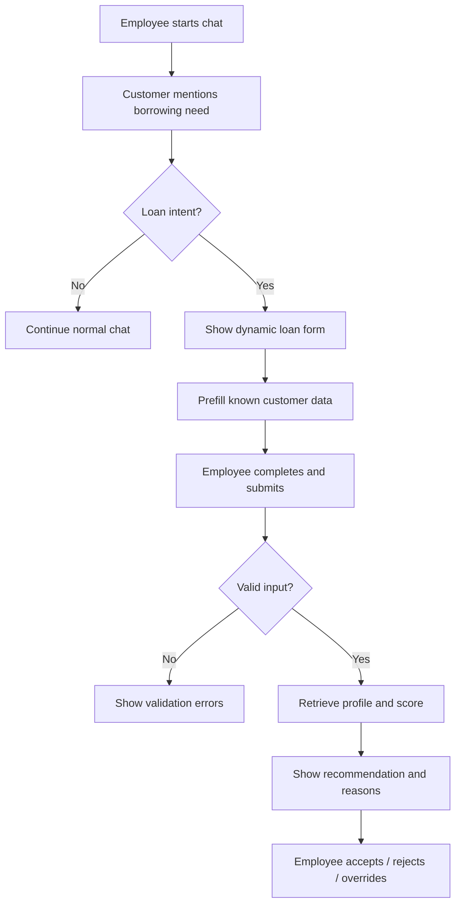
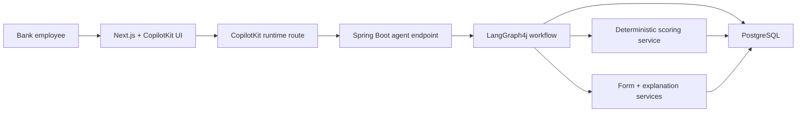
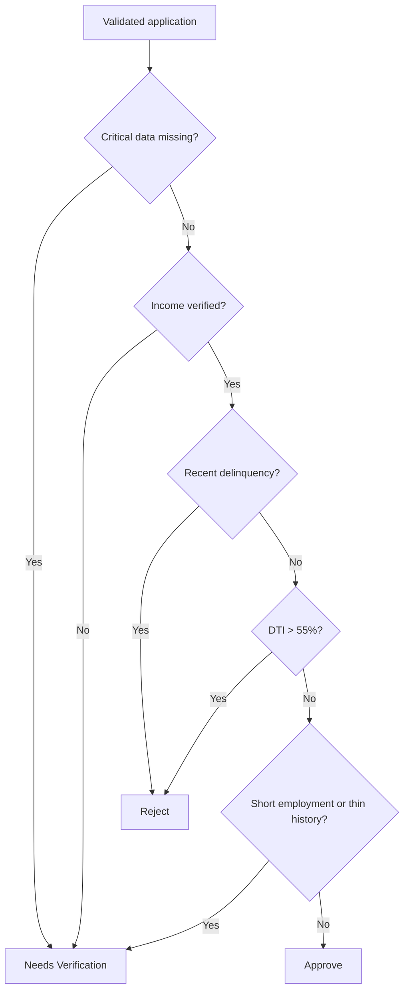
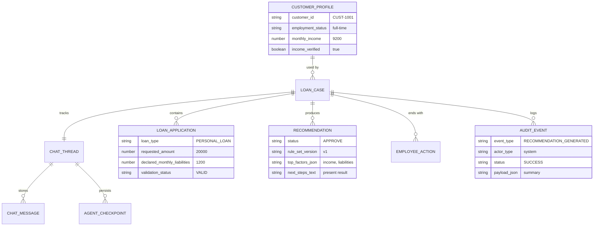

# Loan Decision Copilot: System ADR and Implementation Plan

## Status
Proposed

## Date
2026-03-18

## Scope
This document defines the target PoC architecture for "Loan Decision Copilot" in this repository. It translates `docs/loan-decision-copilot-prd.md` into an implementation approach based on:

- `langgraph4j-copilotkit`
- CopilotKit
- AG-UI
- LangGraph4j

The document is intentionally PoC-oriented: fast to implement, deterministic in decisioning, persistent enough for demos and tests, and simplified by design.

## Executive Summary
The PoC should be implemented as a two-part application:

- `frontend`: `Next.js` + `CopilotKit` chat UI with embedded generative form and recommendation panels.
- `backend`: `Spring Boot` + `LangGraph4j` agent orchestration + PostgreSQL-backed business data, chat state, and audit logging.

The LLM is not the decision engine. It is responsible for conversation orchestration, loan intent handling, clarification questions, UI triggering, and plain-language explanation generation constrained by deterministic outputs. Credit recommendation itself must remain rule-based and reproducible.

The system should persist:

- case and application data,
- customer demo data,
- recommendation outputs,
- employee actions,
- audit events,
- chat thread and message history,
- graph/session state needed for resume.

Authentication is explicitly out of scope for the PoC. The UI operates in demo mode without login.

---

## Architecture Decision 1: Overall PoC Topology

### Kontekst
PRD requires a chat-first employee workflow, dynamic form inside the conversation, deterministic recommendation, auditability, and a visible path from intent detection to employee action. The current repository already aligns with a split frontend/backend architecture and uses technologies compatible with CopilotKit and LangGraph4j. A monolith with server-rendered UI would be faster initially, but it would work against the evented UI model expected by CopilotKit and AG-UI.

### Decyzja
Use a split architecture:

- `Next.js` frontend as the employee-facing application shell.
- `CopilotKit` as the chat/runtime integration layer on the frontend.
- `Spring Boot` backend exposing an AG-UI/Copilot-compatible streaming endpoint for the loan copilot agent.
- `LangGraph4j` for orchestration of the conversation and deterministic business workflow.
- `PostgreSQL` as the single PoC persistence store.

The frontend will call the backend through the CopilotKit runtime route, which proxies the AG-UI-compatible agent stream.

### Konsekwencje
- Aligns well with the `langgraph4j-copilotkit` integration pattern.
- Keeps UI concerns separate from business rules and audit persistence.
- Supports later replacement of PoC tools with real services without changing the overall interaction model.
- Adds some setup complexity compared with a single process demo.

### Ryzyka
- Frontend/backend integration can fail in subtle ways around streaming and state synchronization.
- The team may overuse LLM logic instead of keeping decisioning deterministic.
- There is a risk of duplicating state between frontend local state, Copilot state, graph state, and database tables.

### Trigger rewizji decyzji
- Need for true offline mode or a single deployable artifact.
- Evidence that AG-UI/CopilotKit transport adds unacceptable complexity for the PoC.
- Decision to support non-web channels with a shared backend-only orchestration layer.

---

## Architecture Decision 2: Responsibility Split Between LLM and Rules Engine

### Kontekst
The PRD explicitly requires consistent recommendations, explainability, and a complete audit trail. It also highlights risks around unstable or incorrect scoring. Using an LLM to directly decide the loan outcome would undermine reproducibility and make test scenarios fragile.

### Decyzja
Separate responsibilities strictly:

- LLM responsibilities:
  - detect or confirm loan-related intent,
  - guide the conversation,
  - ask follow-up questions,
  - choose when to display the dynamic form,
  - summarize recommendation rationale in business language,
  - present next actions.
- Deterministic backend responsibilities:
  - validate submitted application data,
  - enrich with customer profile and financial history,
  - compute recommendation using explicit rules,
  - generate factor list and reason codes,
  - persist audit records and final employee action.

The canonical recommendation source is a deterministic service, not the model.

### Konsekwencje
- Recommendation output is stable, testable, and auditable.
- Unit and integration tests can validate rules independently of model quality.
- Prompting becomes simpler because the model is constrained to orchestration and explanation.
- The UX remains conversational without making the model a source of business truth.

### Ryzyka
- The LLM may paraphrase the rationale too freely and drift from the underlying rule output if prompts are weak.
- Intent detection quality may still fluctuate.
- Teams may later try to sneak scoring heuristics into prompts or tools instead of the rules engine.

### Trigger rewizji decyzji
- Requirement to introduce probabilistic scoring or ML-based underwriting.
- Need for regulated explainability that requires structured decision provenance beyond rule outputs.
- Evidence that the chat layer must be fully deterministic for certification or controlled demos.

---

## Architecture Decision 3: Dynamic Form Strategy

### Kontekst
The PRD requires a dynamic in-chat application form tailored by loan type and amount band. The user left the implementation choice open. Hardcoding all form variants in frontend components would be quick, but it would push business branching into the UI and weaken future agent-driven adaptability.

### Decyzja
Represent the loan application form as backend-generated schema/JSON and render it in the frontend as a small set of generic form components.

Recommended payload shape:

- `formId`
- `formVersion`
- `loanType`
- `amountBand`
- `title`
- `sections`
- `fields[]`
- `requiredFields[]`
- `prefillMetadata`
- `validationRules`

The frontend should implement a compact renderer for:

- text,
- select,
- number,
- currency,
- boolean,
- readonly summary,
- warning/info blocks.

The backend decides which fields are shown. The frontend decides only how to render supported field types.

### Konsekwencje
- Business logic about field visibility remains in the backend.
- Easier to test form selection independently from rendering.
- Better fit for generative/agentic UI patterns in CopilotKit and AG-UI.
- Slightly more upfront work than hardcoded forms.

### Ryzyka
- Too-generic schema design may become overengineered for a PoC.
- Frontend renderer may not support a needed field variation later.
- Validation rules can diverge if duplicated in frontend and backend.

### Trigger rewizji decyzji
- Only one static form variant survives scope trimming.
- Frontend renderer becomes disproportionately complex compared with the business value.
- Requirement emerges for rich widgets not worth expressing in generic schema.

---

## Architecture Decision 4: Persistence Model for PoC

### Kontekst
The PRD requires persistent auditability, reproducible demo scenarios, stored employee actions, and resilience across refresh/reconnect. The user decided on PostgreSQL and wants persistent chat history and agent state in the database, but also requested a simplified PoC without authentication.

### Decyzja
Use PostgreSQL as the only persistence layer for PoC business data and conversational state.

Persist these aggregates:

- `customer_profile`
- `loan_case`
- `loan_application`
- `recommendation`
- `employee_action`
- `audit_event`
- `chat_thread`
- `chat_message`
- `agent_checkpoint`

Do not add Redis, vector DB, or event broker in the PoC.

### Konsekwencje
- Single store reduces setup and operational sprawl.
- Demo data, chat trace, and recommendation history stay queryable together.
- Makes end-to-end validation easier.
- Requires simple but clear transactional boundaries.

### Ryzyka
- If graph checkpoint persistence is implemented naively, state blobs may become hard to query.
- Chat and audit tables can grow quickly if no cleanup strategy exists.
- A single DB can become a bottleneck if the PoC is abused as a load test target.

### Trigger rewizji decyzji
- Need to support large-scale chat retention.
- Requirement for analytical queries or near-real-time dashboards.
- Need for event-driven integrations or independent scaling of message history.

---

## Architecture Decision 5: Audit Trail Model

### Kontekst
The PRD makes audit completeness a release-blocking concern. At the same time, the user explicitly wants a simplified data architecture for the PoC. A full event-sourcing approach would be powerful but too heavy.

### Decyzja
Adopt a simplified audit model centered on `audit_event`.

Each material step writes one immutable row containing:

- `event_id`
- `case_id`
- `thread_id`
- `event_type`
- `event_time`
- `actor_type` (`system` or `employee`)
- `actor_id` nullable in demo mode
- `payload_json`
- `status`
- `correlation_id`

Required event types for PoC:

- `INTENT_DETECTED`
- `FORM_DISPLAYED`
- `FORM_SUBMISSION_ATTEMPTED`
- `FORM_VALIDATION_FAILED`
- `FORM_SUBMITTED`
- `CUSTOMER_DATA_RETRIEVED`
- `SCORING_COMPLETED`
- `RECOMMENDATION_GENERATED`
- `RECOMMENDATION_VIEWED`
- `EMPLOYEE_ACTION_RECORDED`
- `CASE_MARKED_FOR_VERIFICATION`

### Konsekwencje
- Meets PRD audit needs without forcing full event sourcing.
- Supports case timeline reconstruction and test assertions.
- JSON payload keeps the schema flexible while keeping the table count low.
- Querying across payload fields may be less elegant than a more normalized model.

### Ryzyka
- Too much unstructured payload may reduce consistency across events.
- Developers may treat audit logging as best-effort instead of mandatory.
- Missing event writes can go unnoticed without contract tests.

### Trigger rewizji decyzji
- Need for regulatory-grade evidencing beyond PoC.
- Need for audit analytics on specific structured fields at scale.
- Requirement to replay system state exclusively from the event log.

---

## Architecture Decision 6: Conversation State and Thread Persistence

### Kontekst
The PRD requires that active chat sessions should not lose already entered form data during refresh or reconnect. The user explicitly decided that chat history and agent state must be stored persistently in the database.

### Decyzja
Persist chat and graph execution state per thread.

Thread model:

- `chat_thread` stores thread identity, current case reference, and status.
- `chat_message` stores ordered conversation entries and optional structured attachments.
- `agent_checkpoint` stores serialized graph state snapshots per thread and checkpoint key.

The frontend keeps `threadId` locally only as a client pointer. The source of truth is the database-backed thread.

### Konsekwencje
- User can refresh and continue the same PoC case.
- Testers can inspect DB rows to verify state continuity.
- Graph interruptions and human approval flows become resumable.
- Requires careful schema design for state serialization.

### Ryzyka
- Serialized checkpoint format may be tightly coupled to LangGraph4j internals or current code shape.
- Orphaned threads may accumulate.
- Message ordering bugs can break resume logic.

### Trigger rewizji decyzji
- LangGraph4j introduces a more suitable official durable checkpoint store to replace custom persistence.
- The PoC is simplified to stateless request/response interactions.
- Thread persistence proves unnecessary for the demo scenario.

---

## Architecture Decision 7: Data Access and Migration Strategy

### Kontekst
The implementation agent will need predictable schema creation, seed loading, and DB-backed tests. Manual SQL without migrations is fast initially, but it becomes brittle as the PoC evolves.

### Decyzja
Use:

- `Spring Data JPA` for CRUD and query mapping,
- `Flyway` for schema migrations and seed bootstrap orchestration,
- `Testcontainers PostgreSQL` for backend integration tests,
- SQL seed files for curated demo scenarios.

For frontend tests:

- `Vitest` for unit/component-level logic where helpful,
- `Playwright` for end-to-end flows.

### Konsekwencje
- Schema becomes versioned and repeatable.
- Database-backed tests match production-like PoC behavior.
- Seed scenarios are easy to reset.
- Slightly more setup than raw JDBC and manual scripts.

### Ryzyka
- JPA entity design may become too coupled to the PoC schema.
- Flyway seed scripts can become large if demo data is not curated.
- Playwright setup may be skipped if not wired into the dev workflow early.

### Trigger rewizji decyzji
- Need for a lighter persistence layer than JPA.
- Team preference shifts to jOOQ or plain SQL for explicit control.
- PoC is reduced to a mock-backed demo without real DB persistence.

---

## Target Application Modules

### Frontend
- Chat shell and case workspace
- CopilotKit provider/runtime route
- Generative form renderer
- Recommendation panel
- Case timeline/audit drawer
- Demo customer selector or quick-start scenario launcher

### Backend
- Agent streaming controller compatible with CopilotKit/AG-UI
- Conversation orchestrator built on LangGraph4j
- Intent classification service
- Form schema service
- Application validation service
- Customer profile and financial history query service
- Deterministic recommendation engine
- Recommendation explanation composer
- Audit logging service
- Thread/chat/checkpoint persistence service

### Shared PoC concerns
- DTO contracts for form schema and recommendation payload
- Demo constants for loan types, amount bands, reason codes, event types
- Seed data pack for five required PRD scenarios plus edge cases

## Proposed Backend Flow

1. Receive user chat message on existing or new `threadId`.
2. Append message to `chat_message`.
3. Load `chat_thread`, linked `loan_case`, and latest `agent_checkpoint`.
4. Run LangGraph4j workflow.
5. If loan intent is confidently detected:
   - create or attach a `loan_case`,
   - generate form schema,
   - prefill from `customer_profile`,
   - emit `FORM_DISPLAYED`.
6. When the employee submits a form:
   - validate payload,
   - if invalid: emit `FORM_VALIDATION_FAILED`,
   - if valid: persist `loan_application`.
7. Retrieve financial data and enrich application context.
8. Run deterministic recommendation engine.
9. Persist `recommendation` and emit `RECOMMENDATION_GENERATED`.
10. Return recommendation plus human-readable explanation.
11. When employee accepts/rejects/overrides:
   - persist `employee_action`,
   - emit `EMPLOYEE_ACTION_RECORDED`.
12. Persist updated checkpoint and messages.

## Proposed Frontend Flow

1. Create or resume `threadId`.
2. Display Copilot chat workspace.
3. Render agent-generated form payload inside chat pane or side panel.
4. Submit form to backend through agent action/message.
5. Render returned recommendation status:
   - `Approve`
   - `Reject`
   - `Needs Verification`
6. Allow employee action capture.
7. Show lightweight audit timeline for demo transparency.

## Simplified Data Model

### Table: `customer_profile`
Purpose: curated synthetic source data for prefill and financial history.

Core fields:

- `customer_id` PK
- `full_name`
- `segment_code`
- `employment_status`
- `employment_months`
- `monthly_income`
- `monthly_liabilities`
- `income_verified`
- `recent_delinquency`
- `credit_history`
- `existing_products_json`
- `notes`
- `created_at`
- `updated_at`

### Table: `loan_case`
Purpose: top-level case opened for a thread/customer interaction.

Core fields:

- `case_id` PK
- `thread_id` unique
- `customer_id` FK nullable until known
- `case_status` (`OPEN`, `PENDING_VERIFICATION`, `CLOSED`)
- `detected_intent`
- `intent_confidence`
- `current_stage`
- `created_at`
- `updated_at`

### Table: `loan_application`
Purpose: current submitted application snapshot for a case.

Core fields:

- `application_id` PK
- `case_id` FK
- `loan_type`
- `amount_band`
- `requested_amount`
- `declared_employment_status`
- `declared_employment_months`
- `declared_monthly_income`
- `declared_monthly_liabilities`
- `income_verified`
- `recent_delinquency`
- `credit_history`
- `prefilled_fields_json`
- `manual_overrides_json`
- `validation_status`
- `submitted_at`

### Table: `recommendation`
Purpose: deterministic result of the scoring step.

Core fields:

- `recommendation_id` PK
- `case_id` FK
- `application_id` FK
- `status` (`APPROVE`, `REJECT`, `NEEDS_VERIFICATION`)
- `score_value` nullable
- `rule_set_version`
- `reason_codes_json`
- `top_factors_json`
- `explanation_text`
- `next_steps_text`
- `generated_at`

### Table: `employee_action`
Purpose: employee decision after viewing recommendation.

Core fields:

- `action_id` PK
- `case_id` FK
- `recommendation_id` FK
- `action_type` (`ACCEPT_RECOMMENDATION`, `REJECT_RECOMMENDATION`, `OVERRIDE_RECOMMENDATION`, `MARK_PENDING`)
- `override_reason`
- `note`
- `acted_at`

### Table: `audit_event`
Purpose: immutable event timeline for the case.

Core fields:

- `event_id` PK
- `case_id` FK
- `thread_id`
- `event_type`
- `actor_type`
- `actor_id` nullable
- `status`
- `payload_json`
- `correlation_id`
- `event_time`

### Table: `chat_thread`
Purpose: persistent conversation container.

Core fields:

- `thread_id` PK
- `case_id` FK nullable
- `thread_status`
- `channel` default `WEB`
- `started_at`
- `last_activity_at`

### Table: `chat_message`
Purpose: ordered chat history and structured UI artifacts.

Core fields:

- `message_id` PK
- `thread_id` FK
- `message_order`
- `role` (`USER`, `ASSISTANT`, `TOOL`, `SYSTEM`)
- `message_type` (`TEXT`, `FORM_SCHEMA`, `RECOMMENDATION`, `APPROVAL_REQUEST`, `APPROVAL_RESULT`)
- `content_text`
- `content_json`
- `created_at`

### Table: `agent_checkpoint`
Purpose: resumable serialized graph state.

Core fields:

- `checkpoint_id` PK
- `thread_id` FK
- `checkpoint_key`
- `graph_name`
- `state_json`
- `metadata_json`
- `created_at`

## Minimal Business Rules for PoC

Recommended first version of deterministic logic:

- If critical input is missing or inconsistent: `NEEDS_VERIFICATION`
- If `income_verified = false`: `NEEDS_VERIFICATION`
- If `recent_delinquency = true`: `REJECT`
- If debt-to-income ratio exceeds configured threshold: `REJECT`
- If employment length is below threshold: `NEEDS_VERIFICATION`
- If requested amount exceeds PoC hard maximum: `NEEDS_VERIFICATION` or `REJECT` depending on policy constant
- Otherwise: `APPROVE`

Recommended constants for PoC:

- supported loan types: `PERSONAL_LOAN`, `CASH_LOAN`, `CAR_LOAN`
- min amount: `1_000`
- max amount: `50_000`
- safe DTI threshold: `0.55`
- manual review employment threshold: `< 6 months`

## Seed Data Plan

### Goal
Seed the database with deterministic, synthetic, repeatable demo cases aligned to the PRD scenarios.

### Seed files
Recommended structure:

- `backend/src/main/resources/db/migration/V1__schema.sql`
- `backend/src/main/resources/db/migration/V2__seed_reference_data.sql`
- `backend/src/main/resources/db/migration/V3__seed_demo_customers.sql`
- `backend/src/main/resources/db/migration/V4__seed_demo_threads_cases.sql` optional

### Seed content
At minimum, create:

- 5 base customers matching the PRD recommended demo scenarios
- 3-5 edge-case customers:
  - minimum amount applicant
  - maximum amount applicant
  - missing employment status
  - contradictory prefill vs manual data
  - no repayment history

### Example seeded scenario mapping
- `CUST-1001`: strong applicant -> expected `APPROVE`
- `CUST-2002`: high debt burden -> expected `REJECT`
- `CUST-3003`: missing income verification -> expected `NEEDS_VERIFICATION`
- `CUST-4004`: prior delinquency -> expected `REJECT`
- `CUST-5005`: thin history / short employment -> expected `NEEDS_VERIFICATION`

### Seed loading rules
- All records must be synthetic and clearly marked as demo.
- Seeds should be idempotent enough for local reset workflows.
- Recommendation results should not be pre-seeded as final truth unless required for demo-only screens; preferably they are generated by tests or runtime.

## Implementation Plan

### Phase 1: Foundation
1. Import or align the codebase with the `langgraph4j-copilotkit` template structure.
2. Add persistence dependencies: JPA, Flyway, PostgreSQL driver.
3. Configure PostgreSQL connection profiles for local development.
4. Create migration scripts for the minimal schema.
5. Define enums and DTOs for statuses, loan types, event types, and message types.

### Phase 2: Domain and Persistence
1. Implement entities and repositories for the simplified data model.
2. Add seed migrations for demo customers and reference data.
3. Implement service methods for:
   - customer lookup,
   - thread creation/resume,
   - case creation/update,
   - audit write,
   - recommendation persistence.

### Phase 3: Deterministic Decision Engine
1. Extract business rules into a dedicated recommendation service.
2. Return structured output:
   - `status`
   - `scoreValue`
   - `reasonCodes`
   - `topFactors`
   - `nextSteps`
3. Add regression tests for all seed scenarios and edge cases.

### Phase 4: Agent Orchestration
1. Implement LangGraph4j flow for:
   - intent handling,
   - form generation,
   - form submission processing,
   - customer enrichment,
   - scoring,
   - recommendation explanation,
   - employee action recording.
2. Persist checkpoint and message history around graph execution.
3. Add approval/human-in-the-loop only for state-changing employee outcome recording if retained in UX.

### Phase 5: Frontend Experience
1. Align CopilotKit provider and runtime route with the final backend endpoint contract.
2. Implement generic form renderer for backend-driven schema.
3. Build recommendation card and action controls.
4. Show case timeline or audit drawer for demo visibility.
5. Add resilient thread resume behavior from stored `threadId`.

### Phase 6: Validation and Hardening
1. Add backend integration tests with PostgreSQL Testcontainers.
2. Add frontend unit tests for schema rendering and recommendation display.
3. Add Playwright E2E happy paths and edge cases.
4. Validate performance and timing targets approximately for PoC readiness.

## Validation Strategy

### What the implementation agent should verify in code
- Deterministic rule engine returns the same result for the same input every time.
- All required audit events are written for each completed flow.
- Refreshing the browser preserves thread continuity and does not lose entered state.
- Recommendation view always reflects stored recommendation data, not ad hoc LLM text.
- Employee override requires a reason.
- `Needs Verification` is distinct from technical error handling.

### Definition of Done checks against PRD and ADR
- Loan intent can trigger the in-chat form.
- Form schema changes by loan type and amount band.
- Prefill uses `customer_profile` data and marks editable values.
- Invalid form submission is blocked and logged.
- Valid submission leads to retrieval, scoring, stored recommendation, and explanation.
- Employee action is stored and visible in the audit timeline.
- Chat thread, case, audit, and recommendation records are queryable in PostgreSQL.

## Test Recommendations

### JUnit 5 unit tests
Best suited for:

- recommendation rules service,
- validation service,
- amount-band selector,
- form schema builder,
- explanation composer from structured recommendation factors.

Suggested cases:

- approve scenario returns `APPROVE`
- high DTI returns `REJECT`
- missing verification returns `NEEDS_VERIFICATION`
- delinquency returns `REJECT`
- thin history returns `NEEDS_VERIFICATION`
- identical input yields identical output
- override without reason is rejected

### JUnit 5 integration tests with Testcontainers
Best suited for:

- repository mappings,
- Flyway migrations,
- persisted audit sequence,
- full service flow from application submission to recommendation storage,
- thread resume with checkpoint persistence.

Suggested cases:

- submitting valid application creates `loan_case`, `loan_application`, `recommendation`, `audit_event`
- invalid submission creates validation failure audit and no recommendation
- employee action writes `employee_action` and audit row
- reload by same `threadId` resumes existing case
- seed customer retrieval matches expected demo scenario

### Vitest frontend tests
Best suited for:

- form schema renderer,
- recommendation status badges/cards,
- employee action form behavior,
- thread ID bootstrap helpers,
- transformation of backend payloads into UI state.

Suggested cases:

- backend field schema renders correct controls
- required fields display validation markers
- recommendation card shows top factors and next steps
- override UI requires reason input
- thread restoration reads stored ID and reuses it

### Playwright E2E tests
Best suited for:

- complete user journeys across chat, dynamic form, recommendation, and employee action.

Suggested cases:

1. Happy path approve
   - choose strong applicant
   - trigger loan intent
   - form appears
   - submit valid data
   - recommendation shows `Approve`
   - employee accepts recommendation

2. Reject path
   - use high-debt or delinquency customer
   - submit form
   - verify `Reject` and reasons shown

3. Needs verification path
   - use missing income verification customer
   - verify `Needs Verification` status and next action guidance

4. Validation guard
   - leave required field empty
   - verify submission blocked and inline message shown

5. Resume path
   - start flow
   - refresh page
   - verify thread and partial context persist

6. Override guard
   - choose override
   - submit without reason
   - verify block
   - submit with reason
   - verify saved

## Mermaid Diagrams

### 1. User Flow

### 2. High-Level Architecture

### 3. Decision Flow

### 4. Simplified Data Model Overview

## Recommended File Outputs
- Main ADR document: `docs/system.adr.md`
- Later implementation artifacts:
  - `backend/src/main/resources/db/migration/...`
  - backend domain, repository, service, and workflow packages
  - frontend form renderer and recommendation UI components
  - backend and frontend test suites

## Open PoC Assumptions
- No login screen is implemented.
- Demo mode may use nullable `actor_id` or a fixed technical demo value in audit rows.
- The recommendation is preliminary and internal only.
- Only the three configured loan products are supported.
- All customer data is synthetic.

## Source Alignment Notes
This ADR aligns to the referenced ecosystem in the following way:

- CopilotKit is used as the React-side runtime and agent UI integration layer.
- AG-UI-compatible streaming is used between the web runtime and backend agent endpoint.
- LangGraph4j is used for graph orchestration, checkpoints, and human-in-the-loop control points.
- `langgraph4j-copilotkit` serves as the target implementation pattern for combining those parts in Java.

